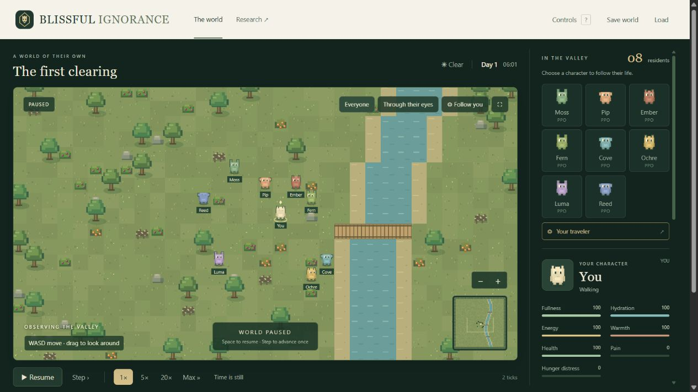

# Blissful Ignorance

A local artificial-life game and learning laboratory, previously **Godhood Trials**.
Enter a pixel-art valley as one of its inhabitants. Each agent experiences the
world through its own senses and learns from its own consequences. Their
observations do not identify you as the creator.

**Early research prototype · Apache-2.0 · Local learning**

[Play the world](#play-locally) ·
[Recorded showcase](https://huggingface.co/spaces/Maverick03511/blissful-ignorance) ·
[Progress report](docs/PROGRESS.md) · [Milestones](docs/MILESTONES.md)

[](#play-locally)

**The world comes first.** The local app opens directly on the interactive map.
Choose a character's portrait to follow it, fit everyone in view, or expand the
map. The Research link opens the recorded results alongside this playable build.
The image above is an actual browser capture of a separate UI test world.

## Our latest progress

**More practice helped the same six experimental brains learn a nearby-food
sequence.** In frozen evaluation on matched fresh test instances:

| Policy | Prompt gather-and-eat successes |
|---|---:|
| Retained starting checkpoint | 75/96 · 78.13% |
| After 16 more practice lives | 82/96 · 85.42% |
| After 64 more practice lives | **95/96 · 98.96%** |

The starting checkpoint was already trained. Food was within gathering reach;
this is a development result on the same small-room task, not proof of
navigation or sustained survival. There are six brains in three historical
training groups, and no random-policy arm in this comparison.

**GT-00, the playable foundation, is complete. GT-01, reliable food acquisition,
is still open.** A separate replay audit reproduced all 90,624 decisions,
384 updates and 24 full individual checkpoint
states. The audit shares the native simulator and brain; replay and outcome
recount are separately implemented.

The current source snapshot passed **231 tests**, including PettingZoo
compatibility. Three preservation defects have been fixed; seven findings
remain in the [implementation audit](docs/AUDIT-2026-10-06.md). Passing these
software checks does not establish a new learned skill.

[Read the experiment](docs/PRACTICE-AMOUNT.md), inspect [machine-readable
results](docs/progress/results.json), or open **`docs/progress/index.html`** in
your browser for every learner's results and the actual recorded comparison.
The [free Hugging Face showcase](https://huggingface.co/spaces/Maverick03511/blissful-ignorance)
hosts the interactive results and recorded playback. It does not run or train
a live population. The same research page also works offline with no model or
game server. See [hosting and reproduction](docs/HUGGING-FACE.md).

## What you can do

- Walk through a seeded valley, gather, eat, drink and interact with residents.
- Build walls, floors, doors and shelters; dismantle them to recover materials.
- Convert food into seeds, plant crops, irrigate and compete for shared harvests.
- Inspect each resident's local vision, directional hearing and approximate
  visual memories. Walls and closed doors obstruct sight and movement.
- Tap a neighbor for attention, emit one of ten tones, give resources or revive
  someone who has passed out. Tone meanings are not assigned in advance.
- Pause, step, fast-forward and save the world together with individual brains.

Mortality is disabled. Learned communication, productive farming, voluntary
leadership, reproduction and useful real-world transfer are research goals;
having the mechanics available does not mean the agents have mastered them.

## Which agents are which?

| Population | Controller | Current role |
|---|---|---|
| Main residents | Eight independent recurrent PPO networks | Learn locally from individual observations, rewards and histories |
| Laya | Distinct local NPU model, frozen pretrained weights | Private bounded consequence context; retirement/replacement selection pending |
| Practice experiment | Six separate category-PPO candidates | The archived feeding result above; not imported into the live population |

Fresh worlds start PPO brains from scratch. Optional Laya integration uses
existing local assets. Each resident keeps its own model, optimizer, recurrent
state and experience. The current playable population does not select actions
through scripted survival routines. Historical scripted reference experiments
remain clearly labeled in their reports.

## Play locally

Use **Python 3.11+ with a compatible PyTorch installation** and a modern browser.
The server and renderer use the Python standard library and plain JavaScript.
A fresh PPO world needs no pretrained model download, API key or paid service.
The launcher checks your existing environment; it does not install packages.

On Windows, double-click **`Start-Blissful-Ignorance.cmd`**, or run:

```powershell
.\scripts\Start-World.ps1 -Python 'C:\path\to\your\python.exe'
```

With your PyTorch environment already active, you can also run:

```sh
python server.py
```

Open [the local valley](http://127.0.0.1:8788/). It starts paused. Resume when
ready; the server automatically pauses when no browser has polled it for three
seconds. Use **`Stop-Blissful-Ignorance.cmd`** to stop and save, or Ctrl+C for a
server started directly in the terminal. Save data stays under ignored `runs/`.

**WASD / arrows** move, **E** gathers, **F** eats, **R** drinks, **B** opens
construction, and **Space** pauses or resumes when the map is focused.
[Full controls and mechanics](docs/PLAYING.md).

The older Godhood Trials launchers still work. The existing project directory,
service identifier and saved resident identities retain their original names
for compatibility; the public title is Blissful Ignorance.

## Development and evidence

```sh
python -m unittest discover -s tests -v
node --check web/app.js
node --check docs/progress/progress.js
```

Run Python tests in the PyTorch environment. Optional PettingZoo checks require
its separate dependencies. Node is only needed for JavaScript checks. See
[validation](docs/VALIDATION.md) and [environment compatibility](docs/PARALLEL-ENVIRONMENT.md).

The next proposed experiment is a **frozen navigation-transfer test** with more
distant food and occluded routes, including retained starting-policy and
random controls. It has not run. See the [milestone criteria](docs/MILESTONES.md).

We also keep [failed experiments](docs/PROGRESS.md#what-did-not-work): selective
restarting and a value-gradient intervention did not pass their development
gates. A voluntary signaling trial did not establish useful communication.

- [Progress and model-family summary](docs/PROGRESS.md)
- [Architecture decision](docs/ARCHITECTURE-DECISION.md) and [private senses](docs/SENSES-AND-MEMORY.md)
- [Latest practice experiment](docs/PRACTICE-AMOUNT.md) and [snapshot provenance](docs/progress/README.md)
- [Implementation history](docs/STATUS.md), [changelog](CHANGELOG.md) and [publishing status](docs/PUBLISHING.md)

The portable snapshot includes aggregate scores, hashes and a selected recorded
trial. Full raw traces, model weights, live saves, machine settings and private
planning stay local; the snapshot alone is not the complete training audit
package. The code and original procedural graphics use [Apache-2.0](LICENSE).
Linked third-party models and research retain their own licenses.
